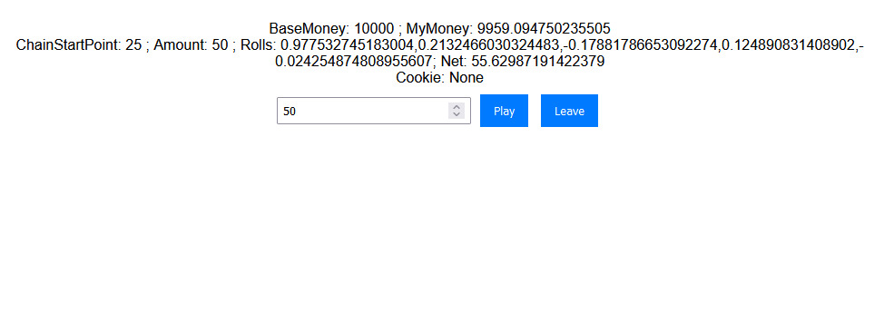
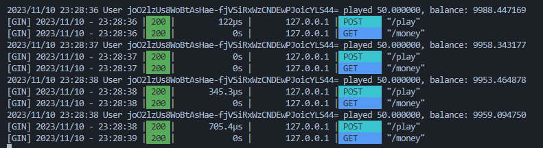

# The Next-Gen Gambling App Powered by WebGPU: BallCancer 2023

# Introduction
In the ever-evolving world of online gambling, a groundbreaking app is set to redefine user experience. Leveraging the cutting-edge capabilities of WebGPU, this new gambling platform promises to deliver unparalleled graphical fidelity, performance, and an immersive gaming environment that has never been seen before in the realm of digital betting.

# Harnessing WebGPU for Enhanced Performance
WebGPU stands at the forefront of browser-based graphical technology. By tapping into this advanced API, the app unlocks the full potential of modern hardware acceleration, allowing for richer visuals and more complex animations without compromising on performance. This means users can enjoy a seamless and fluid gaming experience, even on less powerful devices.

# Immersive Gaming Environment
The app’s utilization of WebGPU enables the creation of stunning 3D environments and realistic textures, bringing the thrill of a real casino right to your screen. From the shimmering lights of slot machines to the intricate designs of card tables, every element is rendered with incredible detail, enhancing the overall gaming experience.

# Safe, Secure, and Responsible Gaming
Understanding the importance of security in online gambling, the app incorporates state-of-the-art encryption and data protection measures. It also promotes responsible gaming through various tools and resources, ensuring a safe and enjoyable experience for all users.

# Cross-Platform Accessibility
Thanks to WebGPU’s cross-platform nature, the app offers a consistent and high-quality experience across various devices and operating systems. Whether you’re playing on a desktop, tablet, or smartphone, the app guarantees an optimal gambling experience without the need for additional software or plugins.

